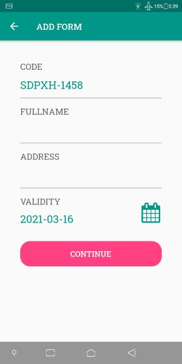
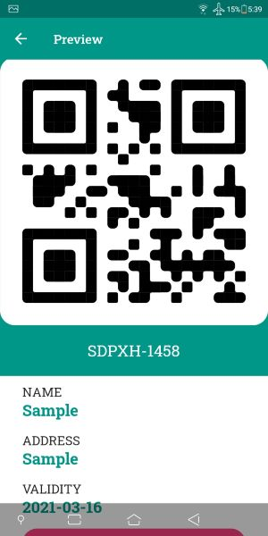

# Quarantine Pass QR Code Scanner

a cross platform mobile app that uses quick response (QR) code printed on quarantine passes is used by authorities to prove if the person is authorized to carry the pass.

## Features

- Login and Authorization
- Scan QR Code
- Save info
- Validating QR Codes
- Generate QR Codes

## Technologies

| Front End      | Back End        |
| -------------- | --------------- |
| Flutter        | Cloud Firestore |
| Dart           |
| Pretty QR Code |
| Provider       |
| Flare Flutter  |

## Screenshots

